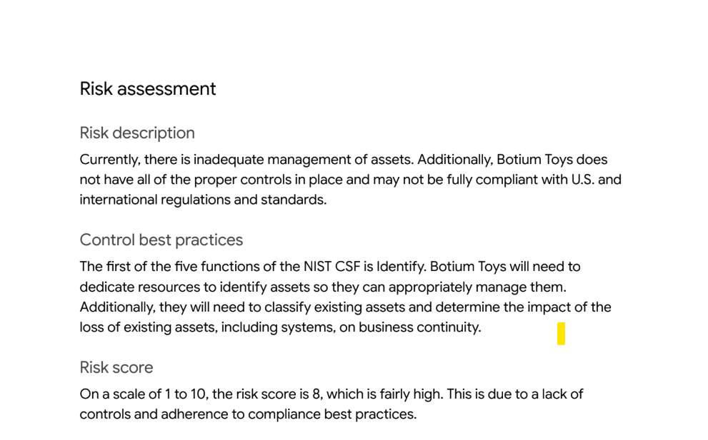
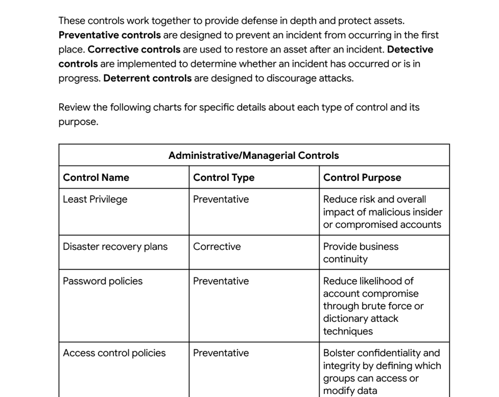
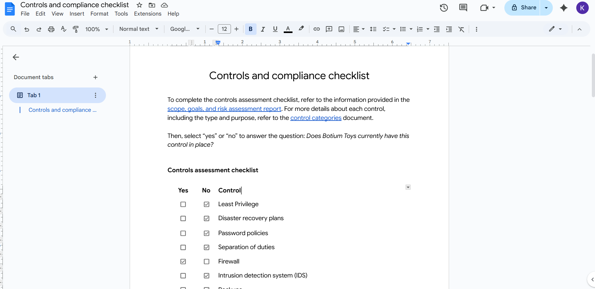
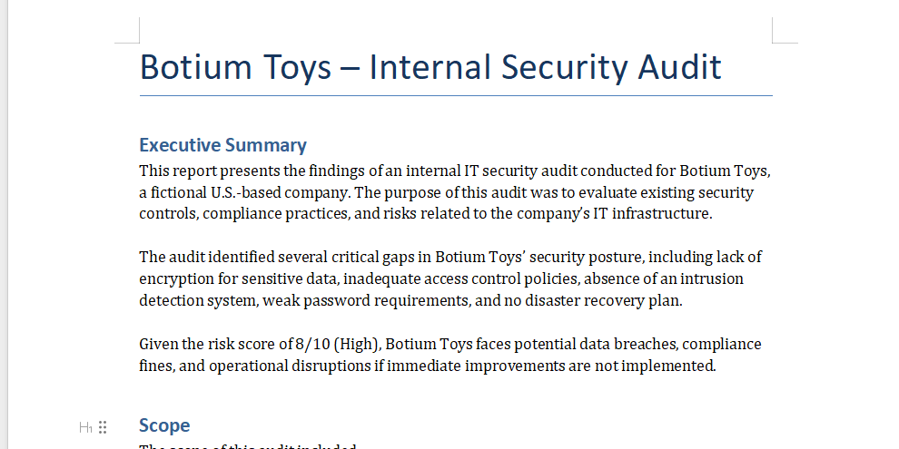

# 🧸 Botium Toys: Internal Security Audit  

## **Description:**  
As part of my **Google Cybersecurity Professional Certificate**, I worked on a simulated case study where I stepped into the role of an internal IT auditor for a fictional U.S. toy company, **Botium Toys**.

The audit was based on the **NIST Cybersecurity Framework (CSF)**, and my role was to:  
- Review the company’s **scope, assets, and risk assessment**.  
- Perform a **controls and compliance checklist audit**.  
- Identify **security gaps** in administrative, technical, and physical controls.  
- Recommend improvements to strengthen Botium Toys’ overall **security posture**.  

---

## Key Features of the Audit:  
- ✅ Completed an **internal IT audit** using NIST CSF guidelines.  
- ✅ Mapped **controls across Administrative, Technical, and Physical categories**.  
- ✅ Identified **key compliance issues** with PCI DSS, GDPR, and general data protection.  
- ✅ Provided **clear recommendations** to mitigate risks (risk score 8/10).  
- ✅ Delivered an **executive-style report** for management.  

---

## Tools & Environment: 
- **Framework Used:** NIST Cybersecurity Framework (Identify, Protect, Detect, Respond, Recover)  
- **Document Preparation:** Google Docs / Microsoft Word  

---

## Usage & Walkthrough:

Since this is an **audit and documentation project**, no executable bash scripts were required, instead, the focus was on **analyzing documents** and **filling the audit checklist**.  

Steps Taken:  

1. **Reviewed Audit Scope & Goals**  
   - Covered all assets (employee devices, internal network, payment processing, online systems, physical warehouse).  
   - Focus: Identify security gaps + compliance risks.  

 
---

2. **Analyzed Risk Assessment Report**  
   - Risk Score = **8/10 (High)**  
   - Weaknesses found:  
     - All employees had unrestricted access to sensitive data.  
     - No encryption for stored credit card data.  
     - Weak password policies.  
     - No backups or disaster recovery plan.  
     - No Intrusion Detection System (IDS).  

  
---

3. **Controls Mapped to NIST CSF**  
   - **Administrative Controls:** Password policy, least privilege, account management, separation of duties.  
   - **Technical Controls:** Firewalls, IDS/IPS, encryption, antivirus, reliable backups.
   - **Physical Controls:** Locks, CCTV, fire detection, safes for sensitive media.  

---

4. **Completed the Controls & Compliance Checklist**  
   - Answered **YES/NO** questions for each control based on findings.  
   - Identified gaps in compliance with **PCI DSS** and **GDPR**.  

---

5. **Generated Final Report**  
   - Prepared an **executive summary** for management.  
   - Wrote findings, risks, and actionable recommendations.  
   - Highlighted the importance of implementing **least privilege, encryption, IDS, and backups** immediately.  

---

## Final Deliverables:
Audit Report (report.docx) → Executive summary, detailed findings, and recommendations.
Audit Checklist (proof.md) → Evidence of completed compliance and control reviews. 

---

## Key Takeaways:
This stimulation helped me strengthen my skills in:
- Applying the NIST Cybersecurity Framework in a practical scenario.
- Identifying and evaluating security controls across people, processes, and technology.
- Understanding how compliance frameworks like PCI DSS and GDPR influence risk.
- Translating technical risks into business language for non-technical stakeholders.

---

It was a great exercise in thinking like a cybersecurity analyst, balancing both the technical findings and how to communicate them effectively to leadership.
