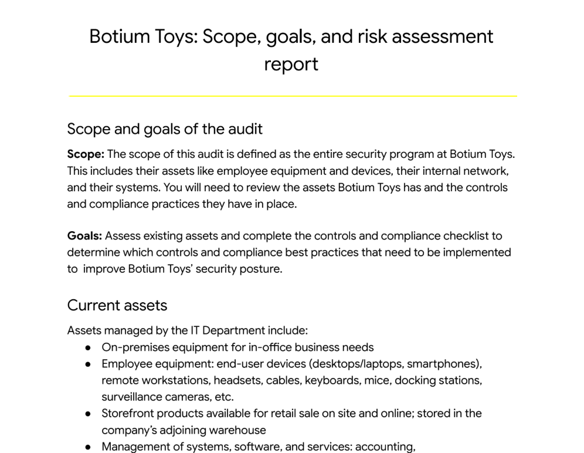

# 🧸 Botium Toys: Internal Security Audit  

## **Description:**  
This project is part of my **Google Cybersecurity Professional Certificate** coursework.  
The scenario involves **conducting an internal IT security audit** for a fictional U.S. toy company called **Botium Toys**.  

The audit was based on the **NIST Cybersecurity Framework (CSF)**, and my role was to:  
- Review the company’s **scope, assets, and risk assessment**.  
- Perform a **controls and compliance checklist audit**.  
- Identify **security gaps** in administrative, technical, and physical controls.  
- Recommend improvements to strengthen Botium Toys’ overall **security posture**.  

---

## Features:  
- ✅ Completed an **internal IT audit** using NIST CSF guidelines.  
- ✅ Mapped **controls across Administrative, Technical, and Physical categories**.  
- ✅ Identified **key compliance issues** with PCI DSS, GDPR, and general data protection.  
- ✅ Provided **clear recommendations** to mitigate risks (risk score 8/10).  
- ✅ Delivered an **executive-style report** for management.  

---

## Tools & Environment: 
- **Framework Used:** NIST Cybersecurity Framework (Identify, Protect, Detect, Respond, Recover)  
- **Document Preparation:** Google Docs / Microsoft Word  
- **simulated case study,** no real-world deployment)  

---

## Usage & Walkthrough:

Since this is an **audit and documentation project**, no executable bash scripts were required, instead, the focus was on **analyzing documents** and **filling the audit checklist**.  

Steps Taken:  

1. **Reviewed Audit Scope & Goals**  
   - Covered all assets (employee devices, internal network, payment processing, online systems, physical warehouse).  
   - Focus: Identify security gaps + compliance risks.  

 

---

2. **Analyzed Risk Assessment Report**  
   - Risk Score = **8/10 (High)**  
   - Weaknesses found:  
     - All employees had unrestricted access to sensitive data.  
     - No encryption for stored credit card data.  
     - Weak password policies.  
     - No backups or disaster recovery plan.  
     - No Intrusion Detection System (IDS).  

   *(screenshot placeholder: `assets/risk_assessment.png`)*  

---

3. **Mapped Controls to NIST CSF Categories**  
   - **Administrative Controls** = Password policy, least privilege, account management, separation of duties.  
   - **Technical Controls** = Firewalls, IDS/IPS, encryption, antivirus, backups.  
   - **Physical Controls** = Locks, CCTV, fire detection, safes.  

   *(screenshot placeholder: `assets/control_mapping.png`)*  

---

4. **Completed the Controls & Compliance Checklist**  
   - Answered **YES/NO** questions for each control based on findings.  
   - Identified gaps in compliance with **PCI DSS** and **GDPR**.  

   *(screenshot placeholder: `assets/checklist.png`)*  

---

5. **Generated Final Report**  
   - Prepared an **executive summary** for management.  
   - Wrote findings, risks, and actionable recommendations.  
   - Highlighted the importance of implementing **least privilege, encryption, IDS, and backups** immediately.  

   *(screenshot placeholder: `assets/report_summary.png`)*  

---

## Output:

The exercise produced two main outputs:  
- `report.docx` → Formal Audit Report (executive summary, scope, findings, recommendations).  
- `proof.md` → Evidence of the completed audit checklist.  

---

## Key Takeaways:
In this simulation, I learned about how to
- **Apply NIST CSF in a real-world scenario**.  
- Practiced identifying **administrative, technical, and physical controls**.  
- Understood the importance of **compliance frameworks** (PCI DSS, GDPR).  
- Lastly, it strengthened my ability to **communicate cybersecurity risks to non-technical stakeholders**.  

---
